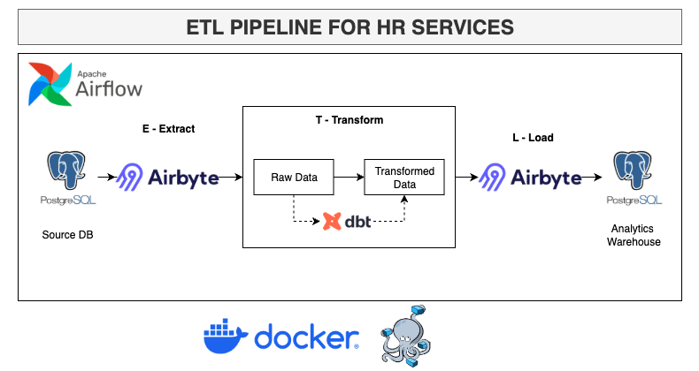

# HR ELT Data Pipeline

## Project Overview

A modern ELT (Extract, Load, Transform) setup running entirely on local, open-source infrastructure to automate the extraction, loading, and transformation of HR data so it's clean, reliable, and ready for analytics without anyone touching a spreadsheet by hand.

## Tech Stack

* **Airbyte (Extraction & Loading)**
  * Handles the actual sync between the source HR database and the warehouse, so I'm not writing custom extraction scripts.
* **dbt (Transformation)**
  * Turns raw tables into clean, tested, version-controlled models using plain SQL. 
* **Apache Airflow (Orchestration)**
  * Makes sure things run in the right order, at the right time, and retries when something breaks. 
* **PostgreSQL (Data Warehouse)**
  * Solid, free, and does the job well. It's both the landing zone for raw data and the final layer analysts actually query.
* **Docker & Docker Compose (Infrastructure)**
  * Why: Everything runs in containers on a shared network (`elt_network`). Means the whole stack spins up the same way on any machine.

## Pipeline Workflow

1. **Extract & Load (Airbyte):** Pulls raw operational HR data from the source system and lands it in a raw schema in Postgres.
2. **Transform (dbt):** Cleans, joins, and reshapes the raw tables into proper dimensional models that are actually usable for reporting.

## How to Run Locally

* **Prerequisites:** Docker Desktop, Git.
* **Execution Steps:**
  1. Spin up the environment: In your terminal, cd to the root of your project and then execute the command `./elt.sh`
  2. Configure connections (set up the Airbyte source/destination connectors, and point the dbt profile at the warehouse).
  3. Trigger and monitor the DAG from the Airflow UI.

## When this Pipeline will be useful :

Right now this pipeline moves HR data from one place to a warehouse and makes it query-ready, the setup here is basically the foundation for a real internal HR data platform. A few ways this could grow:

* **Single source of truth for HR:** Instead of headcount, attrition, and comp data living in five different spreadsheets, this becomes the one place everyone pulls numbers from: finance, recruiting, leadership dashboards, all reading from the same clean models.
* **Plug in more sources:** Because Airbyte handles ingestion, adding a new HR tool (ATS, payroll system, engagement surveys) later is mostly just configuring a new connector, not writing a new pipeline from scratch.
* **Automated reporting:** Once the dbt models are solid, it's a short hop to scheduled dashboards for things like turnover trends, DEI metrics, or time-to-hire, stuff HR teams usually track manually.
* **Data quality you can actually trust:** dbt's built-in testing means broken or missing data gets caught before it reaches a dashboard, instead of someone noticing a weird number three weeks later.

Basically, this started as "get HR data into a warehouse," but the architecture is generic enough to become the actual backbone for internal people-analytics which is a pretty valuable thing to have lying around.